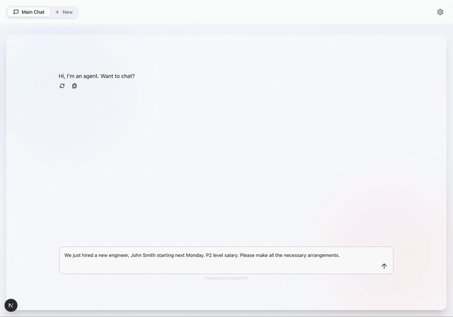

# A2A-Demo: Cross-Departmental AI Agent Integration

A demonstration project showcasing the integration between **AG-UI** and **A2A** protocols, enabling seamless communication between AI agents across different departments and systems.

## 🎯 Overview

This demo features an **HR Agent** as the primary interface that can intelligently delegate tasks to specialized departmental agents:

- **💰 Finance Agent** - Handles budgets, expenses, payroll, and financial queries
- **💻 IT Agent** - Manages technical requests, system access, and IT support
- **🏢 Buildings Management Agent** - Oversees facilities, maintenance, and office resources

The HR agent acts as a central coordinator, automatically routing complex requests to the appropriate specialists and orchestrating multi-departmental workflows.

## 🎬 Demo



_See the A2A protocol in action as agents seamlessly communicate across departments_

## 🔗 Protocol Integration

### AG-UI Protocol

Provides the user interface and conversation management, enabling natural language interactions with the agent system.

### A2A (Agent-to-Agent) Protocol

Enables secure, structured communication between different AI agents, allowing them to:

- Share context and information
- Delegate specialized tasks
- Coordinate complex, cross-departmental workflows
- Maintain conversation continuity across agent handoffs

## 🚀 Key Features

- **🤝 Cross-Departmental Coordination**: HR agent seamlessly communicates with specialized agents
- **🔄 Intelligent Task Routing**: Automatically determines which agent(s) can best handle specific requests
- **📋 Context Preservation**: Maintains conversation context across agent interactions
- **⚡ Real-time Communication**: Live streaming of agent responses and tool calls
- **🎛️ Multi-Agent Orchestration**: Handles complex workflows requiring multiple departments

## 🛠️ Example Use Cases

**Employee Onboarding**

```
User: "Set up a new employee John Doe starting Monday"
HR Agent → IT Agent: "Create user account and email for John Doe"
HR Agent → Buildings: "Assign desk and access card for new hire"
HR Agent → Finance: "Add John Doe to payroll system"
```

**Budget Request with IT Requirements**

```
User: "I need approval for a $5000 software license and server setup"
HR Agent → Finance: "Review budget availability for $5000 expense"
HR Agent → IT: "Assess technical requirements for software deployment"
```

**Facility Issue with Security Implications**

```
User: "The keycard reader is broken in the secure server room"
HR Agent → Buildings: "Schedule repair for keycard reader"
HR Agent → IT: "Implement temporary security measures for server room"
```

## 🏗️ Architecture

```
┌─────────────────┐    ┌─────────────────┐
│   Web Frontend  │    │   AG-UI Client  │
│    (Next.js)    │◄──►│   Integration   │
└─────────────────┘    └─────────────────┘
         │                       │
         ▼                       ▼
┌─────────────────────────────────────────┐
│            HR Agent                     │
│        (Central Coordinator)            │
└─────────────────────────────────────────┘
         │           │           │
         ▼           ▼           ▼
    ┌─────────┐ ┌─────────┐ ┌─────────┐
    │Finance  │ │   IT    │ │Buildings│
    │ Agent   │ │ Agent   │ │  Agent  │
    └─────────┘ └─────────┘ └─────────┘
```

## 🚦 Getting Started

### Prerequisites

- Node.js 18+ and pnpm
- Python 3.12+
- OpenAI API Key

### 1. Start the Web Application

```bash
# Install dependencies
pnpm install

# Set your OpenAI API key
export OPENAI_API_KEY=your_openai_api_key_here

# Start the development server
pnpm dev
```

The application will be available at `http://localhost:3000`

### 2. Setup and Run the Agents

```bash
# Navigate to agents directory
cd agents

# Create virtual environment (one-time setup)
uv venv .venv --python 3.12
source .venv/bin/activate

# Install dependencies (one-time setup)
uv pip install -r pyproject.toml --all-extras

# Set your OpenAI API key
export OPENAI_API_KEY=your_openai_api_key_here

# Start all agents
./run_agents.sh
```

This will start all three departmental agents simultaneously:

- Finance Agent on `http://localhost:8001`
- IT Agent on `http://localhost:8002`
- Buildings Management Agent on `http://localhost:8003`

Press **Ctrl+C** to stop all agents.

### 3. Try It Out

1. Open the web application at `http://localhost:3000`
2. Start a conversation with the HR agent
3. Try cross-departmental requests like:
   - "Help me onboard a new employee"
   - "I need to request a budget for new office equipment"
   - "Set up IT access for our new intern"

## 🧪 Development

### Adding New Agents

1. Create a new agent in the `agents/` directory
2. Update `run_agents.sh` to include the new agent
3. Configure the agent URL in the frontend integration

### Customizing Agent Capabilities

Each agent's capabilities are defined in their respective Python files in the `agents/` directory. You can modify or extend their tool definitions to add new functionality.

## 📚 Learn More

- [AG-UI Documentation](https://docs.ag-ui.com)
- [A2A Protocol Docs](https://a2aprotocol.ai)
- [CopilotKit Integration Guide](https://docs.copilotkit.ai)

## 🤝 Contributing

This is a demonstration project showcasing protocol integration. Feel free to explore the code and adapt it for your own agent communication needs.

## 📄 License

MIT License - See LICENSE file for details.
